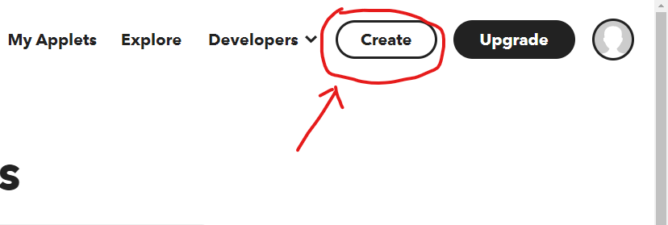
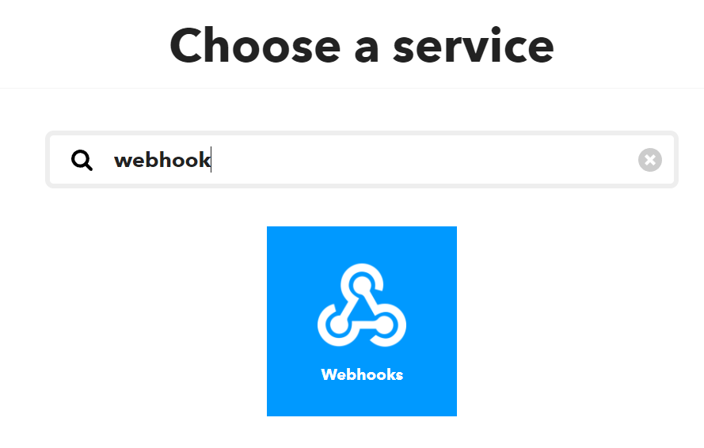
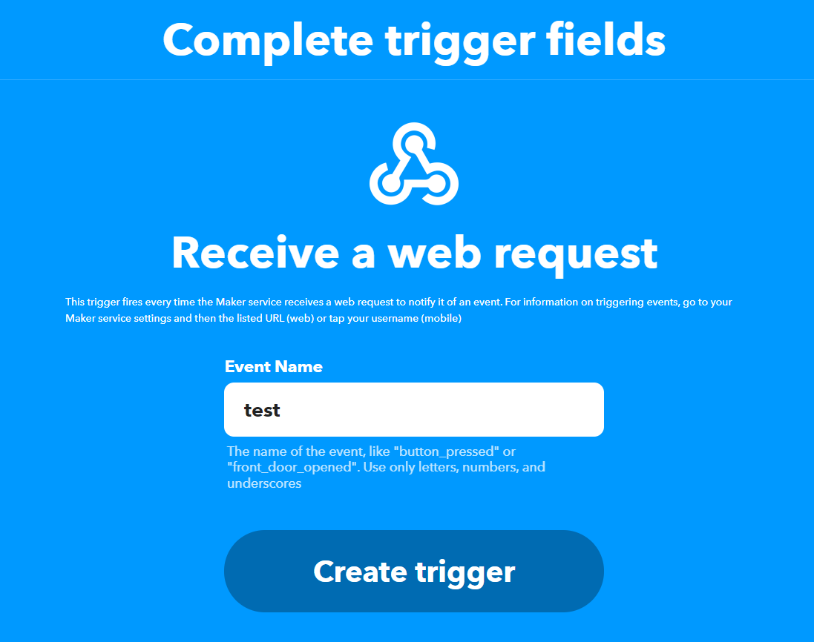
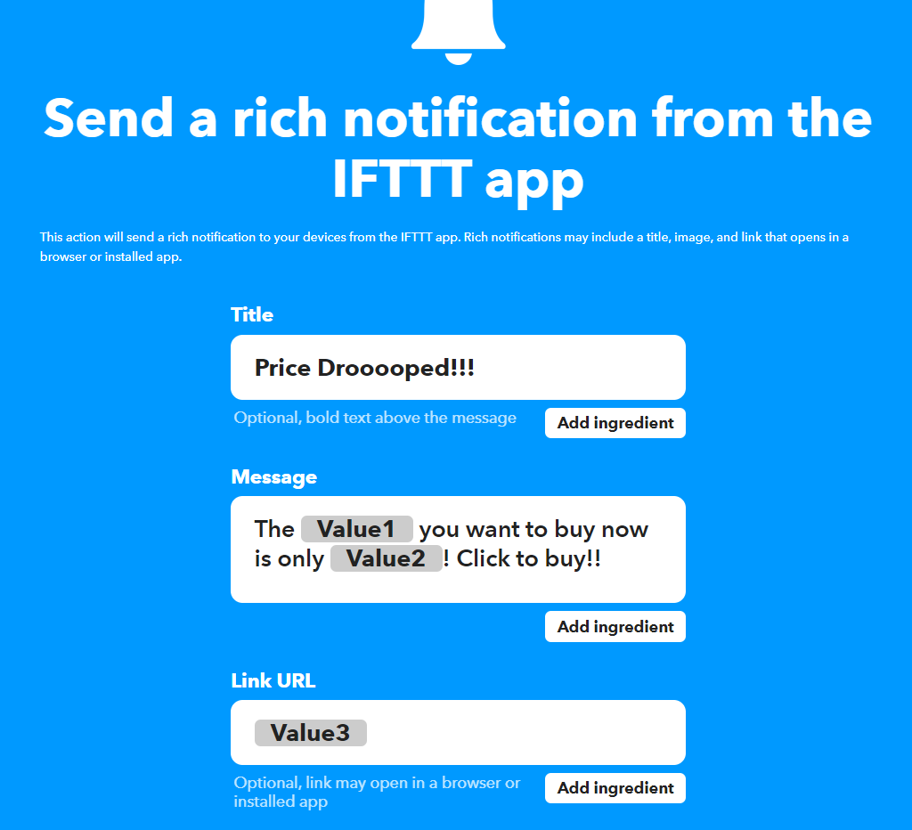
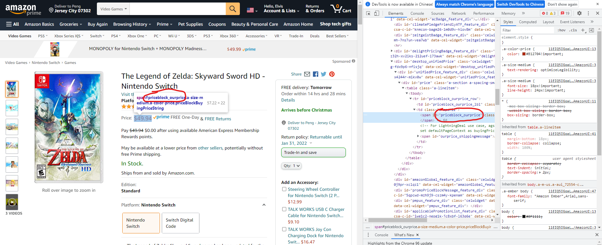
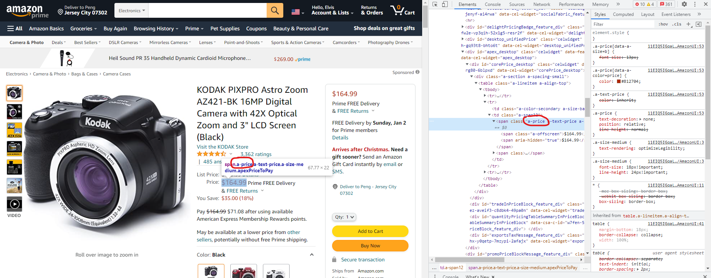
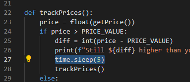

# EE629_IoT Project: Amatracker
Amatracker is an Amazon price tracking tool written in Python.

## Functionality
Users are able to set an expected price for a specific Amazon product, the program will keep tracking the product price. Once the price lower than user's expected price, program will alert user by cloud services.

### Demonstration
<br>


## Requirement
[Requests](https://docs.python-requests.org/en/latest/) will be used to send HTTP/1.1 requests to Amazon server. <br>
You can install it by:
```sh
$ python -m pip install requests
```

[Beautiful Soup 4](https://www.crummy.com/software/BeautifulSoup/bs4/doc/) will be used to grabbing data from Amazon website. <br>
You can install it by:
```sh
$ sudo pip install beautifulsoup4
```
[smtplib](https://docs.python.org/3/library/smtplib.html) is a SMTP protocol client for Python. It will be used to send mail to any internet machine with an SMTP or ESMTP listener daemon. <br>
You can install it by:
```sh
$ python -m pip install secure-smtplib
```
## Set Your Data
<span style="font-family:Consolas;color:yellow">URL</span> is the link of your Amazon product page.<br>
You can put your expected price in <span style="font-family:Consolas;color:yellow">PRICE_VALUE</span>.<br>
<span style="font-family:Consolas;color:yellow">EMAIL_ADDRESS</span> is the Email address for receiving Email alert. You also need to put the password of Email account in server.login().<br>
<span style="font-family:Consolas;color:yellow">WEBHOOK</span> is your IFTTT webhook URL for receiving push notification on smartphone. The way to get your IFTTT webhook will be introduced below.

## Create IFTTT Webhook
1. Go to [IFTTT](https://ifttt.com/) official website, and create your account.
2. Back to IFTTT home page, click "Create" on top right corner.
<br>
3. Click "Add" in "If this", search "Webhook", and click.
<br>
4. Select "Receive a web request", and make a name for it. Then click "Create trigger".
<br>
5. Click "Add" in "Then That", search "Notifications", and click.
6. Select "Send a rich notification from the IFTTT app". Here you can manage how the text shows in push notification. <br>There three variables here: <br><span style="font-family:Consolas;color:yellow">Value1</span> = Product Name<br><span style="font-family:Consolas;color:yellow">Value2</span> = Current Price<br><span style="font-family:Consolas;color:yellow">Value3</span> = URL of the Amazon product.<br>
So make sure you put them at the right place, and click "Create action".<br><span style="font-size: 130%">Example:</span>
<br>
<br>

### Find your Webhook URL
You can always find your Webhook URL under [Webhooks Settings](https://ifttt.com/maker_webhooks/settings) page.

## Known issue
1. Since Amazon US keeps changing products class dynamically, it's highly possible to fail when tracking Amazon US items. But luckily, Amatracker is working on most Amazon regions.
<br>
<br>
2. If you tracking Amazon's webpage too frequently, Amazon may temporarily block your ip. This could be avoid by changing the track frequency in time.sleep()
<br>